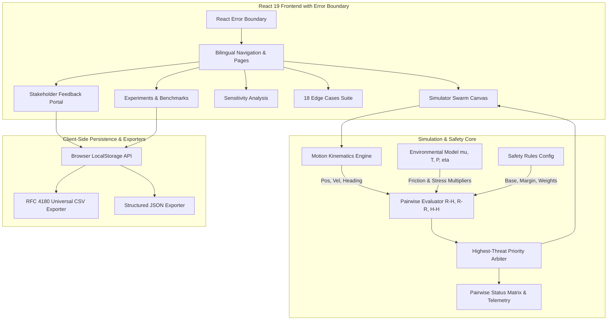

# Dynamic Human-Robot Safety-Zone Simulator for Process Plants

[](https://www.typescriptlang.org/)
[](https://react.dev/)
[](https://tailwindcss.com/)
[](https://vite.dev/)
[]()
[]()
[]()

> **RESEARCH PROTOTYPE NOTICE**: This software is an academic decision-support prototype. It is an **ISO 13855-informed research/prototype** implementation designed to evaluate dynamic safety envelope concepts (accounting for ISO/TS 15066 and ISO 13849 safety principles). It is NOT an industrial safety-certified system and does not claim legal safety certification for physical machinery.

---

## 1. Project Overview
In industrial process plants (petrochemical refineries, specialty chemical facilities, pharmaceutical manufacturing plants), Autonomous Mobile Robots (AMRs) and human workers share narrow corridors, pump aisles, and maintenance bays.

Conventional safety systems rely on **fixed, static exclusion perimeters** (e.g., halting an AMR whenever any worker breaches a static 4.5-meter radius). While fail-safe, rigid static zones trigger excessive nuisance stops during harmless parallel transit while providing inadequate braking buffers on slippery floors or high-speed head-on convergence.

This project delivers a deterministic, real-time, browser-based dynamic safety simulator that computes adaptive safety envelopes based on instantaneous kinematics, human task multipliers, environmental floor/atmospheric conditions, and multi-agent swarm arbitration.

---

## 2. System Architecture & Flow



---

## 3. Technology Stack & Client-Side Architecture

* **Frontend Framework**: React 19 (TypeScript, strict mode)
* **Styling & UI Components**: Tailwind CSS v4, Lucide React icons
* **Data Visualization**: HTML5 Canvas 2D Rendering Engine, Recharts
* **Build System & Dev Server**: Vite v8
* **Error Resilience**: Application-level React Error Boundary (graceful recovery UI)
* **Client-Side Persistence**: Browser `localStorage` (No external backend API or SQL database required)
* **Data Serializers**: RFC 4180 CSV serialization, schema-validated JSON

---

## 4. Development Pillars Across Reviews

### Review 1 Baseline ($34.3/35, 98%$):
* Single AMR ($N=1$) + Single Human ($M=1$) dynamic safety-distance calculation ($5.92\text{ m}$ nominal baseline).
* Interactive 2D plant canvas ($100\text{m} \times 100\text{m}$), waypoint editor, telemetry dual-trace chart, sensitivity sweeps, and 6 initial failure cases.

### Review 2 Pillars ($32.2/35, 92%$):
1. **Pillar 1 — Environmental Physics**: Floor friction ($\mu \in [0.15, 1.0]$), ambient multiplier $\lambda_{\text{ambient}}(T, P)$, and sensor optical degradation ($\eta \in [0, 0.70]$).
2. **Pillar 2 — Multi-Agent Swarms**: Synchronous simulation of $ge 2$ AMRs and $ge 2$ Workers with 6-pair evaluation matrix and highest-threat priority arbitration.
3. **Pillar 3 — Stakeholder Evaluation**: 10-question questionnaire using a 5-point Likert scale with 4 role personas and CSV/JSON exports. Validation status: `PENDING ACTUAL TRIALS`.

### Review 3 Hardening & Documentation:
* **Error Boundary & Robustness**: React Error Boundary, input clamping, NaN safeguards, and malformed storage recovery.
* **Granular Unit Testing**: Expanded test suite to 32 deterministic tests across 5 modules with full test documentation ([`docs/testing.md`](./docs/testing.md)).
* **Data Schemas & Architecture Clarification**: Complete documentation of `localStorage` schemas and client-side service interfaces ([`docs/data-schema.md`](./docs/data-schema.md)).

---

## 5. Mathematical Formulations

### 5.1 Robot-Human Dynamic Required Distance ($D_{\text{required,RH}}$):
$$D_{\text{required,RH}} = \left[ D_{\text{base,RH}} + \frac{v_r \cdot t_{\text{stop}} \cdot w_r}{\mu_{\text{floor}}} + (v_h \cdot t_{\text{react}} \cdot w_h \cdot \lambda_{\text{ambient}}) + C_{\text{env}} \right] \cdot \text{TaskFactor} \cdot \text{DirFactor} + M_{\text{safety,RH}}$$

Where:
* $\lambda_{\text{ambient}}(T, P) = 1.0 + \frac{|T - 25|}{100} + \frac{|P - 1.013|}{10}$
* $C_{\text{env}} = (0.5 \cdot t_{\text{react}} \cdot f_r) \cdot (1 + \eta \cdot 1.5) + (\eta \cdot 1.2)$
* $0.15 \le \mu_{\text{floor}} \le 1.00$, $\quad 0.0 \le \eta_{\text{sensor}} \le 0.70$

### 5.2 Robot-Robot Combined Braking Distance ($D_{\text{required,RR}}$):
$$D_{\text{required,RR}} = \left[ D_{\text{base,RR}} + \frac{v_{r1} \cdot t_{\text{stop1}} \cdot w_r + v_{r2} \cdot t_{\text{stop2}} \cdot w_r}{\mu_{\text{floor}}} + C_{\text{sensor,RR}} \right] \cdot \text{DirFactor}_{RR} + M_{\text{safety,RR}}$$

### 5.3 Human-Human Inter-Worker Proximity ($D_{\text{required,HH}}$):
$$D_{\text{required,HH}} = D_{\text{base,HH}} + \frac{v_{h1} \cdot t_{\text{react1}} + v_{h2} \cdot t_{\text{react2}}}{2} \cdot \lambda_{\text{ambient}} + M_{\text{safety,HH}}$$

---

## 6. Multi-Agent Swarm Failure Boundary Cases (18 Total)

The test harness evaluates 12 Single-Agent cases (`EC-01`..`EC-12`) and 6 Multi-Agent cases (`MULTI-EC-01`..`MULTI-EC-06`):
1. **MULTI-EC-01**: Coincident spawn / agents starting at the same location ($D=0.0\text{ m}$).
2. **MULTI-EC-02**: Four agents occupying the same position, producing multiple simultaneous `EMERGENCY` pair evaluations without memory fault.
3. **MULTI-EC-03**: Two robots moving head-on toward each other and correctly detecting the Robot-Robot threat.
4. **MULTI-EC-04**: One robot surrounded by multiple humans, with all relevant Robot-Human pairs evaluated and the highest threat selected.
5. **MULTI-EC-05**: Active/inactive agent handling (inactive entities excluded from pairwise matrix).
6. **MULTI-EC-06**: Out-of-bounds agent handling (coordinates outside $100\text{m}\times 100\text{m}$ grid evaluated safely).

---

## 7. Measured Experimental Benchmarks

Empirically measured from automated runner scripts (`scripts/runEnvironmentalExperiment.ts` and `scripts/runMultiAgentExperiment.ts`):

### Environmental Benchmarks (`docs/data/environmental_experiments_results.csv`):
| Condition Code | Condition Description | Friction ($\mu$) | Temp ($^\circ$C) | Noise ($\eta$) | Max Req ($D_{\text{req}}$) | $\Delta D_{\text{req}}$ vs Baseline | Peak Risk |
| :--- | :--- | :---: | :---: | :---: | :---: | :---: | :---: |
| **COND-A** | Nominal Dry Clean Floor | 1.00 | 25 | 0.00 | **6.07 m** | **+0.00 m (0%)** | UNSAFE |
| **COND-B** | Wet Washdown Area Floor | 0.65 | 28 | 0.05 | **7.38 m** | **+1.31 m (+21.6%)** | UNSAFE |
| **COND-C** | Oil / Chemical Spill Slick | 0.35 | 30 | 0.10 | **10.37 m** | **+4.30 m (+70.8%)** | UNSAFE |
| **COND-D** | Optical Sensor Mist / Dust | 1.00 | 25 | 0.40 | **7.04 m** | **+0.97 m (+16.0%)** | UNSAFE |
| **COND-E** | Elevated Temperature Stress | 1.00 | 45 | 0.00 | **6.25 m** | **+0.18 m (+3.0%)** | UNSAFE |

### Multi-Agent Swarm Latency Profile (`docs/data/multi_agent_experiments_results.csv`):
| Experiment ID | Scenario Name | Active Pairs | Friction ($\mu$) | Min Sep | Max Req | Critical Threat | Peak State | Mean Latency | Max Latency |
| :--- | :--- | :---: | :---: | :---: | :---: | :---: | :---: | :---: | :---: |
| **MULTI-EXP-01** | Intersection Crossing | 6 | 1.00 | **0.05 m** | **7.05 m** | AMR-01 ↔ AMR-02 | **EMERGENCY** | **38 $\mu$s** | **930 $\mu$s** |
| **MULTI-EXP-02** | Worker-Heavy Aisle | 3 | 1.00 | **2.00 m** | **8.65 m** | AMR-01 ↔ Worker-01 | **UNSAFE** | **16 $\mu$s** | **99 $\mu$s** |
| **MULTI-EXP-03** | Plant Convergence | 6 | 0.65 | **0.02 m** | **10.03 m** | AMR-01 ↔ Worker-01 | **EMERGENCY** | **28 $\mu$s** | **386 $\mu$s** | Plant Convergence | 6 | 0.65 | **0.02 m** | **10.03 m** | AMR-01 ↔ Worker-01 | **EMERGENCY** | **69 $\mu$s** | **603 $\mu$s** |

---

## 8. Data Schema & Persistence Clarification

The application is fully client-side and requires **no external database or HTTP backend**.

* **LocalStorage Key**: `safety_simulator_stakeholder_evals_v2`
* **Data Schema Details**: See [`docs/data-schema.md`](./docs/data-schema.md) for full TypeScript interfaces, CSV column schemas (RFC 4180), and JSON structures.
* **Stakeholder Validation Status**: **`PENDING ACTUAL TRIALS`** (0 synthetic/fake responses recorded).

---

## 9. Installation, Testing & Build Verification

### Prerequisites:
* Node.js v18+ (tested on Node.js v24)
* npm v9+

### Setup & Run:
```bash
# 1. Clone repository
git clone https://github.com/TOMBALAJI93/dynamic-human-robot-safety-zone-simulator.git
cd dynamic-human-robot-safety-zone-simulator

# 2. Install dependencies
npm install

# 3. Run automated test suite (32 tests)
npm test

# 4. Run multi-agent benchmark experiments
npm run benchmark

# 5. Build production bundle (tsc + vite)
npm run build

# 6. Launch local development server
npm run dev
```

---

## 10. Technical Documentation Index

1. [`docs/testing.md`](./docs/testing.md) — Complete 32-test unit and system verification matrix.
2. [`docs/error-handling.md`](./docs/error-handling.md) — React error boundary, input sanitization, and fault recovery.
3. [`docs/data-schema.md`](./docs/data-schema.md) — LocalStorage, CSV, JSON schemas, and internal service interfaces.
4. [`docs/review-3-report.md`](./docs/review-3-report.md) — Final College Review 3 evaluation report.
5. [`docs/final-verification-checklist.md`](./docs/final-verification-checklist.md) — Compliance and deliverable checklist.
6. [`docs/experiment-notebook.md`](./docs/experiment-notebook.md) — Empirical environmental and multi-agent benchmark logs.
7. [`docs/failure-mode-analysis.md`](./docs/failure-mode-analysis.md) — 18 boundary edge cases analysis.
8. [`docs/assumptions-and-limitations.md`](./docs/assumptions-and-limitations.md) — System boundaries and academic constraints.
9. [`docs/user-feedback-summary.md`](./docs/user-feedback-summary.md) — Stakeholder questionnaire protocol and validation status.

---

## 11. Current Project Status & Academic Scope

> **Review 2 development scope is implemented and tested, with stakeholder validation pending actual trials.**

* **Review 1 Baseline**: Preserved ($34.3/35, 98\%$).
* **Review 2 Pillars (Environmental, Multi-Agent, Stakeholder Portal)**: Complete.
* **Review 3 Hardening (Error Boundaries, Testing Docs, Data Schemas)**: Complete.
